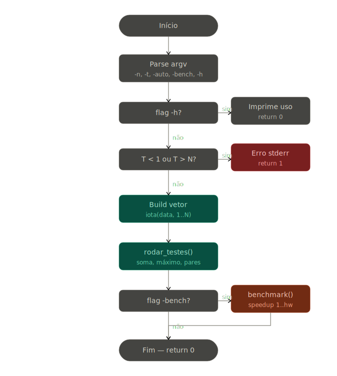
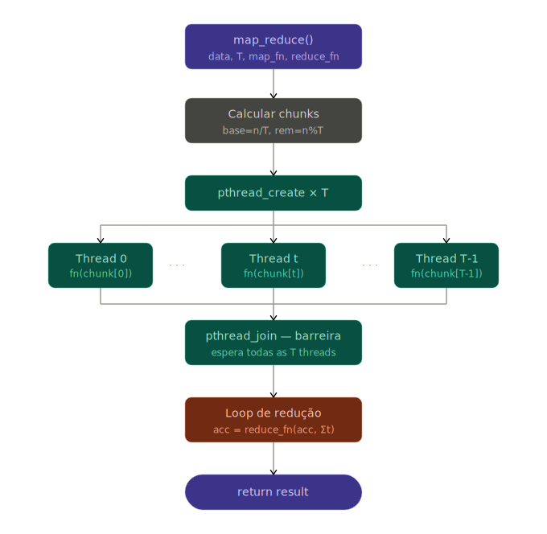

# Parallel Map-Reduce Framework (Pthreads)

## Visão Geral
Evolução do protótipo de soma paralela (WIP) para um framework completo, genérico e parametrizável via linha de comando. A arquitetura foi refatorada para dissociar a lógica de concorrência e particionamento da lógica de negócios, permitindo a execução de múltiplas operações matemáticas utilizando a mesma infraestrutura de threads.

## Arquitetura e Injeção de Dependências

O núcleo do algoritmo agora suporta tipagem genérica para as operações através de ponteiros de função:

* `MapFn`: Assinatura para funções de mapeamento (`long long (*)(const int*, int)`).
* `ReduceFn`: Assinatura para funções de consolidação (`long long (*)(long long, long long)`).

A estrutura de comunicação (`ThreadArgs`) foi expandida para carregar o ponteiro da função de mapeamento designada, permitindo que cada *worker* execute rotinas distintas sem alteração estrutural no loop da thread.

## Novidades e Melhorias (Versão Definitiva)

1. **Controle Total via CLI:** Implementação de parâmetros de linha de comando para configuração dinâmica do ambiente de execução:
   * `-n <N>`: Define o tamanho do vetor (Padrão: 1.000.000).
   * `-t <T>`: Define o número de threads manualmente.
   * `-auto`: Delega a definição de threads à capacidade física da máquina.
   * `-bench`: Ativa o módulo de telemetria e perfilamento.
2. **Auto-Detecção de Hardware:** Identificação cross-platform de *cores* lógicos nativos utilizando `sysconf` (Linux) e `GetSystemInfo` (Windows).
3. **Operações Intercambiáveis:** Inclusão de três fluxos de processamento nativos (Map e Reduce associados):
   * Soma Total (`fn_soma` + `red_soma`).
   * Valor Máximo (`fn_max` + `red_max`).
   * Contagem de Pares (`fn_contar` + `red_soma`).
4. **Módulo de Benchmark:** Sistema integrado de medição de tempo e cálculo de *speedup*. Realiza média móvel de 5 execuções para mitigar ruído térmico/escalonamento de SO ao comparar execuções de $1$ até $T_{max}$ threads.

## Fluxo de Execução Genérico

1. **Instanciação:** `map_reduce` recebe o vetor, número de threads, funções e a identidade matemática da operação (ex: `0` para soma, `LLONG_MIN` para máximo).
2. **Distribuição (MAP):** Os *chunks* são calculados (com tratamento do `remainder`) e as threads são criadas passando o envelope que agora contém `map_fn`.
3. **Sincronização:** Barreira implícita aguardando as chamadas de `pthread_join`.
4. **Consolidação (REDUCE):** Aplicação sequencial da `reduce_fn` sobre os resultados parciais, partindo do valor identidade.

## Validação e Corretude Expandida

O pipeline valida a corretude estrutural cruzando o resultado do Map-Reduce com fórmulas matemáticas fechadas, gerando um *status* de integridade `[OK]` ou `[ERRO]`:

* **Soma Total:** $S = \frac{N(N+1)}{2}$
* **Valor Máximo:** $M = N$ *(Garantido pela sequência gerada via `std::iota`)*
* **Contagem de Pares:** $C = \lfloor \frac{N}{2} \rfloor$

## Instruções de Compilação e Uso

**Compilação (Otimizada):**
```bash
g++ -O2 -pthread Algoritmo_MapReduce.cpp -o map_reduce

# Executa os testes usando todas as threads lógicas do processador
./map_reduce -auto

# Escala customizada: 5 milhões de elementos processados por 8 threads
./map_reduce -n 5000000 -t 8

# Medição de Speedup (1 até N threads da máquina)
./map_reduce -bench
