# Parallel Sum Map-Reduce (Pthreads)

## Visão Geral

Implementação funcional de um algoritmo de soma paralela seguindo o modelo Map-Reduce simplificado utilizando a biblioteca `pthread`. O sistema divide um vetor de inteiros em *chunks* processados de forma independente por threads *worker* e consolidados pela thread principal.

## Arquitetura e Estrutura de Dados

### ThreadArgs
Estrutura utilizada como "envelope" para comunicação entre a thread principal e os *workers*:
* Ponteiro para o início do sub-vetor.
* Tamanho do *chunk*.
* Campo para armazenamento do resultado parcial.

## Fluxo de Execução

### 1. Divisão de Chunks
A partição dos dados é calculada dividindo o tamanho total $N$ pelo número de threads $T$. 
* **Tratamento de Resto:** O valor residual ($N \pmod T$) é adicionado integralmente ao último *chunk*, garantindo a cobertura total dos elementos mesmo quando $N$ não é divisível por $T$.

### 2. Fase MAP (`map_sum`)
Cada thread executa o processamento sobre seu segmento designado:
* **Isolamento de Memória:** Não há acesso a memória compartilhada durante a iteração.
* **Concorrência:** Elimina a necessidade de primitivas de sincronização (mutexes) durante a fase de mapeamento, otimizando o *throughput*.
* **Armazenamento:** O resultado parcial é escrito diretamente no campo `result` da estrutura `ThreadArgs` correspondente.

### 3. Barreira Implícita (`pthread_join`)
A thread principal executa um loop de `pthread_join`, bloqueando o progresso até que todos os *workers* finalizem suas tarefas. Esta etapa garante a consistência dos dados para a fase seguinte.

### 4. Fase REDUCE (`reduce_sum`)
Processamento serial realizado após a terminação das threads:
* Iteração sobre o vetor de `ThreadArgs`.
* Acúmulo dos resultados parciais em um valor total único.

## Validação e Corretude
A integridade do algoritmo é verificada através da fórmula de Gauss para a soma de uma progressão aritmética:

$$S = \frac{N(N+1)}{2}$$

**Vantagens do método de teste:**
1. **Detecção de Erros de Particionamento:** Identifica falhas de sobreposição ou omissão de elementos nos *chunks*. O erro de um único elemento invalida o resultado final.
2. **Independência Algorítmica:** O gabarito é obtido por via analítica, eliminando contaminação por possíveis bugs lógicos no particionamento do código.
3. **Validação de Pipeline:** O teste de corretude funcional cobre desde a divisão inicial até a redução final (divisão → cálculo paralelo → redução).

## Status do Projeto e Limitações
Classificado como **Proof of Concept (PoC)** ou **WIP (Work in Progress)** devido às seguintes características:
* **Acoplamento:** Função de mapeamento fixa para operação de soma.
* **Interface:** Ausência de parâmetros de entrada via CLI ou configuração dinâmica de vetores/funções intercambiáveis.
* **Robustez:** Falta de tratamento de erros exaustivo para chamadas `pthread_*` e ausência de telemetria de desempenho.
* **Objetivo:** Demonstração da mecânica de concorrência e lógica de particionamento de carga.
